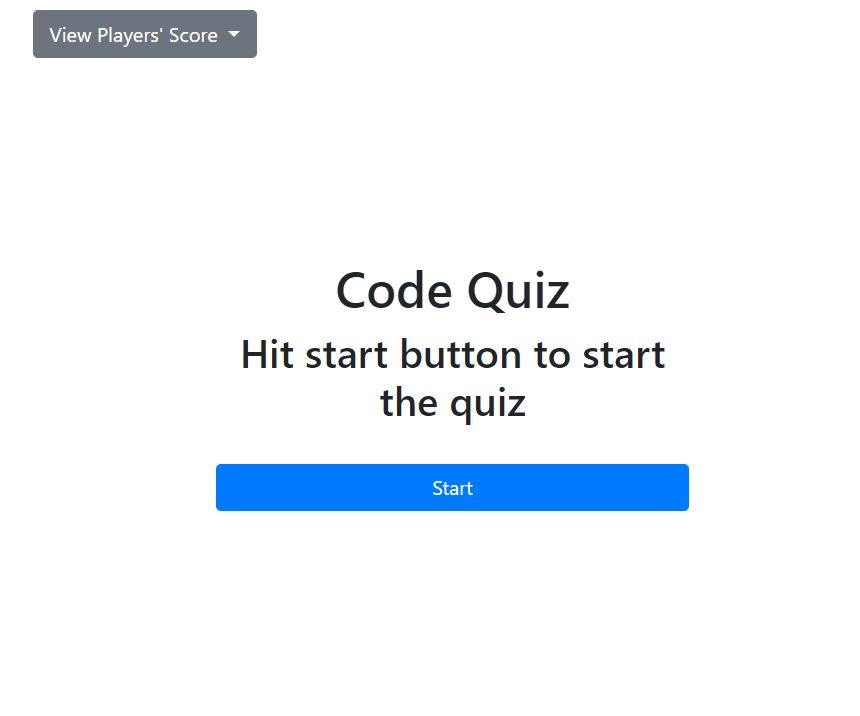

# A javascript quiz project designed by using plain javascript 

## Overview
The quiz has 6 questions. And you have to complete it within one miniute. Everytime you enter a correct answer you will get 10 points otherwise you will lose 10 points and the time will be subtracted by 10 from the clock. The game will end when all questions are answered or the timer reaches 0. Then you can save my initials and score and chekout all player's score by clicking the view player's score dropdown.

## Deploy Site

